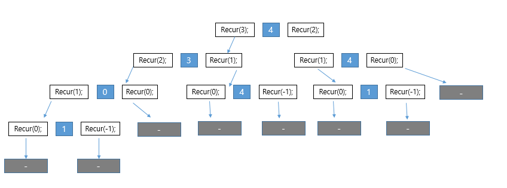

이번 과제는 3~4주차 묶음 과제입니다

11월20일은 스터디 하지않습니다.

11월27일까지 완료하세요


지난 시간  스택과 관련하여 아래의 블로그를 읽어보세요.

https://yaboong.github.io/java/2018/05/26/java-memory-management/


또한 각자 코드의 clear기능을 요약했습니다.

누군가는 for문을 돌리며 stack를 초기화하고 있고, 누군가는 새로운 배열을 생성하고, 누군가는 포인터의 인덱스만 초기화하였습니다.


##### 문제1) 아래의 블로그를 참조하고 어떤 방식을 취하는게 왜 좋을지 작성해주세요.

https://yaboong.github.io/java/2018/06/09/java-garbage-collection/

-------------------------------------------------------------------------------------------------------


#### 재귀 알고리즘-1

재귀란?

어떤 사건이 자기 자신을 포함하고 다시 자기 자신을 사용하여 정의될 때 재귀적(recursive)이라고 한다.

이러한 재귀의 개념을 사용하면 1부터 시작하여 2,3,....과 같이 무한하게 이어지는 자연수를 아래처럼 정의할 수 있다.


```
1. 1은 자연수입니다.
2. 자연수 n의 바로 다음 수도 자연수이다.
```

재귀적 정의 (recursive definition)에 의해 무한으로 존재하는 자연수를 위의 두 문장으로 정의 할 수 있다. 재귀를 효과적으로 사용하면 이런 정의뿐만 아니라 프로그램도 간결하게 할 수 있다.


##### 팩토리얼 구하기

재귀의 사용 예로 가장 먼저 살펴볼 문제는 음이 아닌 정수의 팩토리얼(factorial)을 구하는 프로그램이다. 음이 아닌 정수 n의 팩토리얼(n!)은 아래처럼 재귀적으로 정의 할 수 있다.

```
1. 0!=1
2. n > 0 이면 n!= n x (n-1)!
```

10의 팩토리얼은 10! 은 10 * 9!로 구할 수 있고 그 우변에서 사용되는 식 9!는 9 * 8!로 구할 수 있다.

factorial 메서드는 그 내부에서 factorial 메서드를 호출한다. 이처럼 자신과 같은 메서드를 호출하면 직접(direct) 재귀이다.

간접(indirect) 재귀는 메서드 a가 메서드 b를 호출하고, 다시 메서드 b가 메서드 a를 호출하는 구조로 이루어진다.


재귀 알고리즘에 알맞은 경우는 '풀어야 할 문제', '계산할 메서드', '처리할 데이터 구조'가 재귀로 정의되는 경우이다. '팩토리얼 값을 구하는 예'는 많은 재귀 알고리즘 사용 방법 가운데 하나이다.


##### 문제2.유클리드 호제법

두 정수의 최대공약수(greatest common divisor)를 재귀적으로 구하는 방법이다. 유클리드 호제법에 대해 자세한 설명과 코드 구현하라.


##### 문제3. 재귀 메서드를 호출하지 않고 factorial 메서드를 작성하라.

 

#### 재귀 알고리즘의 분석

재귀 알고리즘을 분석하기 위한 하향식(top down) 분석과 상향식(bottom up) 분석을 Recur 클래스를 통해 알아본다.

recur 메서드는 factorial 메서드나 gcd 메서드와 달리 메서드 안에서 재귀 호출을 2회 실행한다. 이처럼 재귀 호출을 여러 회 실행하는 메서드를 순수하게(genuinely) 재귀적이라고 하며, 실제 동작은 매우 복잡하다.


이런 복잡한 구조를 가진 재귀 메서드는 전략적으로 분석해야한다.

여기서는 recur 메서드를 하향식과 상향식의 두방법으로 분석한다.


##### 하향식 분석 [패키지에 topdown.png있음]

매개변수 n으로 4를 전달하면 recur 메서드는 아래 과정을 순서대로 실행한다.

```
1. recur(3)을 실행한다.
2. 4를 출력한다.
3. recur(2)를 실행한다.
```

물론 (2)에서 4를 출력하는것은 (1)의 recur(3)가 실행이 완료된 이후이다.



이처럼 가장 위쪽에 위치한 상자의 메서드 호출부터 시작해 계단식으로 자세히 조사하는 분석 기법을 하향식 분석(top-down analysis)이라고 한다.

그런데 이 그림 안에는 recur(1), recur(2)의 호출이 여러번 있다. 

꼭대기(top)부터 분석하면 이렇게 같은 메서드의 호출이 여러 번 나올 수 있기 때문에 '하향식 분석이 반드시 효율적이다' 라고 말할 수는 없다.


##### 상향식 분석

위쪽부터 분석하는 하향식 분석과는 대조적으로 아래쪽부터 쌓아 올리며 분석하는 방법이 상향식 분석 (bottom-up analysis)이다. recur 메서드는 n이 양수일 때만 실행하므로 먼저 recur(1)을 생각해보겠다.

```
1. recur(0)을 실행한다.
2. 1을 출력한다.
3. recur(-1)을 실행한다.
```

여기서 (1)의 recur(0)과 (3)의 recur(-1)은 출력할 내용이 없다. 따라서 (2)의 1만 출력한다. 그럼 recur(2)에 대해 생각해 보자.

```
1. recur(1)을 실행한다.
2. 2를 출력한다.
3. recur(0)을 실행한다.
```

(1)의 recur(1)은 1을 출력하고 (3)의 recur(0)은 출력할 내용이 없다. 전체 과정을 거치면 1과 2가 출력이 된다. 이작업을 recur(4)까지 쌓아 올려 설명한 내용은 다음과 같다.

```
recur(-1) 	: 아무것도 하지 않음
recur(0) 	: 아무것도 하지않음
recur(1) 	: recur(0) 1 recur(-1) 	-> 1
recur(2) 	: recur(1) 2 recur(0) 	-> 1 2
recur(3)  	: recur(2) 3 recur(1) 	-> 1 2 3 1
recur(4)	: recur(3) 4 recur(2) 	-> 1 2 3 1 4 1 2
```


#### 문제4. 아래의 recur2 메서드를 보고 하향식 분석과 상향식 분석을 수행하라. [설명과 사진 첨부해주세요]

```
static void recur2(int n) {
	if ( n > 0 ) {
		recur2(n-2);
		System.out.prinlnt(n);
		recur2(n-1);
	}
}
```


#### 문제5. 위 Recur 클래스의 recur 메소드를 재귀호출을 사용하지않고, 앞서 배운 Stack을 이용하여 구현하라.

