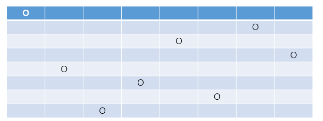

#### 하노이의 탑

하노이의 탑은 작은 원반이 위에, 큰 원반이 아래에 위치할 수 있도록 원반을 3개의 기둥 사이에서 옮기는 문제이다. 

모든 원반은 크기가 다르고 처음에는 모든 원반이 이 규칙에 맞게 첫 번째 기둥에 쌓여 있다. 

이 상태에서 모든 원반을 세 번째 기둥으로 최소의 횟수로 옮기면 된다. 

원반은 1개씩만 옮길 수 있고, 큰 원반을 작은 원반 위에 쌓을 수 없다.

#### [문제 1].  하노이의 탑을 코드로 구현[시간복잡도 포함], 하향식 분석

#### 8퀸 문제

8퀸 문제는 재귀 알고리즘에 대한 이해를 돕기 위한 예제로 자주 등장할 뿐만 아니라 19세기의 유명한 수학자 카를 프리드리히 가우스가 잘못된 해답을 낸 사실로도 잘 알려진 문제이다. 

문제는 다음과 같다.

서로 공격하여 잡을 수 없도록 8개의 퀸을 8 x 8 체스판에 놓아라

* 퀸은 서 있는 지점에서 체스판의 어떤 지점으로든 여덟 방향으로 직선 이동이 가능하다.

이 문제의 정답은 92가지의 조합이다. 다음 그림은 그중의 한 방법을 나타낸 것이다.

체스판의 가로 줄을 행, 세로 줄을 열이라 하고 배열 인덱스에 맞추어 행과 열에 0 ~ 7의 번호를 부여한다. 위 그림에 놓인 퀸은 왼쪽부터 차례로 0행 0열, 4행 1열, 7행 2열, 5행 3열, 2행 4열, 6행 5열, 1행 6열, 3행 7열이다.

**퀸 배치하기**

8개의 퀸을 배치하는 조합에 대해 알아본다. 

체스판은 64칸 ( 8 x 8 ) 이므로 처음에 퀸을 1개 배치할 때는 64칸 중 아무 곳이나 선택할 수 있습니다.

다음 퀸을 배치할 때는 나머지 63칸에서 임의로 선택한다. 마찬가지로 8번째까지 생각하면 다음처럼

64 x 63 x 62 x 61 x 60 x 59 x 58 x 57 = ㅡ.ㅡ 

가지의 조합이 만들어진다.  

그런데 이 조합을 모두 나열하고 각각의 조합이 8퀸 문제의 조건을 만족하는지 조사하는 것은 현실적이지 않다. 

퀸은 자신과 같은 열에 있는 다른 퀸을 공격할 수 있으므로 아래와 같은 규칙을 세울 수 있다.

**[규칙 1] 각 열에 퀸을 1개만 배치한다**

**가지 뻗기 - QueenB 클래스 참조**

이렇게 하면 퀸을 배치하는 조합의 수는 많이 줄어들었지만 여전히 그 수는

8 x 8 x 8 x 8 x 8 x 8 x 8 x 8 = ㅡ.ㅡ;;;

가지이다. 여전히 엄청나게 많으며 이 또한 8퀸 문제를 만족하는 풀이는 하나도 없다.

왜냐하면 퀸은 자신과 같은 행에 있는 다른 퀸을 공격 할 수 있기 때문이다.

그래서 다음과 같은 규칙이 추가된다.

**[규칙 2] 각 행에 퀸을 1개만 배치한다.**

**분기한정법 - QueenBB 클래스 참조**

이처럼 필요하지 않은 분기를 없애 불필요한 조합을 줄이는 방법을 한정(bounding) 조작이라 하고, 

가지 뻗기와 한정 조작을 조합하여 문제를 풀어가는 방법을 분기 한정법(branching and bounding method)이라고 한다.

#### [문제 2] 위 QueenBB 클래스의 분기한정방식은 퀸이 행 방향과 열 방향으로 겹쳐지지 않는 조합을 나열하기만 했다.

**이런 경우는 8퀸 문제가 아닌 8룩(Rook) 문제를 풀었다.' 라고 말할 수 있다.**

**퀸은 대각선 방향[/,\] 으로도 이동할 수 있기 때문에 어떤 대각선에서 보더라도 퀸을 1개만 배치하는 한정 조작을 추가해야한다.**

**완전하게 8퀸문제를 해결한 EightQueen 클래스를 작성하라.** [시공간복잡도 포함]

