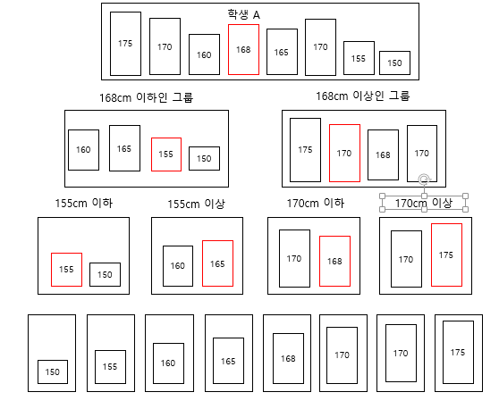
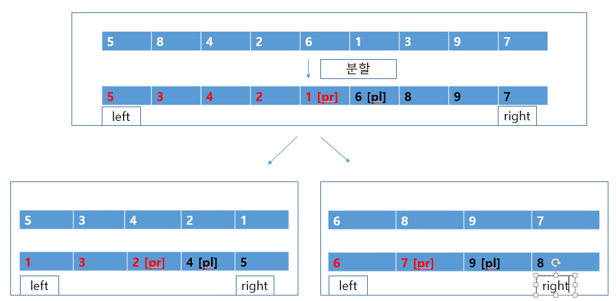

코드에 주석 꼭 달아주세요

1,2 번 틀린 문제 재 확인해주세요. 

코드에 주석달아가고 디버그하면서 해당 문제 푼게 맞는지 확인하세요 꼭


왜 그렇게 생각해서 그렇게 코딩했는지 주석으로 꼭 달아주세요


==========================================================

정렬 쪽은 알아야 할 게 많습니다.

진도가 느리더라도 양해해주세요.

모든 문제에는 시공간 복잡도 작성해주세요

<hr>

#### 퀵 정렬

퀵 정렬은 일반적으로 사용되고 있는 아주 빠른 정렬 알고리즘이다.

아래의 그림은 퀵 정렬 알고리즘으로 학생 수가 8명인 그룹을 키 순서대로 정렬한 모습이다.

1. 먼저 어느 한 사람의 키를 선택한다.

2. 키가 168cm인 학생 A를 선택할 경우 그 학생을 기준으로 학생 A의 키보다 작은 사람의 그룹과 큰 사람의 그룹으로 나눈다.
3. 이때 이 학생 A(그룹을 나누는 기준)을 피벗(pivot)이라 한다.  퀵 정렬은 각 그룹에 대해 피벗 설정과 그룹 나눔을 반복하며 모든 그룹이 1명이 되면 정렬을 마친다.

***** 피벗은 마음대로 선택할 수 있다. 또한 이 피벗을 어느 하나의 그룹에 포함시키고자 할 경우 왼쪽 그룹과 오른쪽 그룹 어디에 들어가도 상관없다.**




기본 개념을 살펴봤으니 이제 자세히 살펴보자.

<hr>

#### 배열을 두 그룹으로 나누기

먼저 배열을 두 그룹으로 나누는 순서에 대해 살펴보자.

다음의 배열에서 피벗으로 6을 선택하여 나눈다. 피벗을 x, 왼쪽 끝 요소의 인덱스 pl을 왼쪽 커서, 쯕 요소의 인덱스 pr을 오른쪽 커서라고 한다.

| pl[0]                             | 1    | 2    | 3    | x[4]    | 5    | 6    | 7    | pr[8] |
| --------------------------------- | ---- | ---- | ---- | ------- | ---- | ---- | ---- | ----- |
| <span style="color:red;">5</span> | 7    | 1    | 4    | ***6*** | 2    | 3    | 9    | 8     |

<br>

그룹을 나누려면 피벗 이하의 요소를 배열 왼쪽으로, 이상의 요소를 배열 오른쪽으로 옮겨야 한다. 그렇게 하려면 아래의 작업을 먼저 수행해야한다.

```
1. a[pl] >= x가 성립하는 요소를 찾을 때 까지 pl을 오른쪽으로 스캔한다.
2. a[pr] <= x가 성립하는 요소를 찾을 때 까지 pr을 왼쪽으로 스캔한다.
```

이 과정을 거치면 pl과 pr은 아래 그림의 위치에서 멈추게 된다. pl이 위치한 지점은 피벗 값 이상의 요소가 있는 지점이고 pr이 위치한 지점은 피벗 값 이하의 요소가 있는 지점이다. 

<br>

**여기서 왼쪽(pl)과 오른쪽(pr) 커서가 가리키는 요소 a[pl]과 a[pr]의 값을 교환한다. 그러면 피벗 이하의 값은 왼쪽으로 이동하고 피벗 이상의 값은 오른쪽으로 이동한다.**

<br>

빨간 글씨 끼리 교환 7 <-> 3

| 0    | pl[1]                             | 2    | 3    | x[4]    | 5    | pr[6]                             | 7    | 8    |
| ---- | --------------------------------- | ---- | ---- | ------- | ---- | --------------------------------- | ---- | ---- |
| 5    | <span style="color:red;">7</span> | 1    | 4    | ***6*** | 2    | <span style="color:red;">3</span> | 9    | 8    |

다시 스캔을 진행하면 왼쪽과 오른쪽 커서는 아래 그림의 위치에서 멈춘다.

**다시 이 두 요소 a[pl]과 a[pr]의 값을 교환한다.**

빨간 글씨 끼리 교환 6 <-> 2

| 0    | 1    | 2    | 3    | pl x[4]                               | pr[5]                             | 6    | 7    | 8    |
| ---- | ---- | ---- | ---- | ------------------------------------- | --------------------------------- | ---- | ---- | ---- |
| 5    | 3    | 1    | 4    | **<span style="color:red;">6</span>** | <span style="color:red;">2</span> | 7    | 9    | 8    |

다시 스캔을 계속하면 아래 그림처럼 두 커서(pl, pr) 가 교차하게 된다.

| 0    | 1    | 2    | 3    | pr 4 | pl x[피벗] 5                      | 6    | 7    | 8    |
| ---- | ---- | ---- | ---- | ---- | --------------------------------- | ---- | ---- | ---- |
| 5    | 3    | 1    | 4    | 2    | <span style="color:red;">6</span> | 7    | 9    | 8    |


pl과 pr이 교차하면 그룹을 나누는 과정이 끝나고 배열은 아래처럼 두 그룹으로 나누어진다.

```
피벗 이하의 그룹 : a[0], ..., a[pl-1];

피벗 이상의 그룹 : a[pr+1], ... , a[n-1];
```

또 그룹을 나누는 작업이 끝난 다음 pl > pr + 1인 경우에는 다음과 같은 그룹이 생길 수 있다.

```
피벗과 일치하는 값을 가지는 그룹 : a[pr+1], ... ,a[pl-1]
```


앞의 예에서는 피벗과 일치하는 값을 가지는 그룹이 만들어지지 않았다. 

아래 그림은 피벗과 일치하는 그룹이 만들어지는 예이다. a는 초기 상태이고 피벗의 값은 5이다.

a.

| [pl] 0                            | 1    | 2    | 3    | [pivot] 4 | 5    | 6    | 7    | [pr] 8                            |
| --------------------------------- | ---- | ---- | ---- | --------- | ---- | ---- | ---- | --------------------------------- |
| <span style="color:red;">1</span> | 8    | 7    | 4    | **5**     | 2    | 6    | 3    | <span style="color:red;">9</span> |

b.

| 0    | [pl] 1                            | 2    | 3    | [pivot] 4 | 5    | 6    | [pr] 7                            | 8    |
| ---- | --------------------------------- | ---- | ---- | --------- | ---- | ---- | --------------------------------- | ---- |
| 1    | <span style="color:red;">8</span> | 7    | 4    | **5**     | 2    | 6    | <span style="color:red;">3</span> | 9    |

c.

| 0    | 1    | [pl] 2                            | 3    | [pivot] 4 | [pr] 5                            | 6    | 7    | 8    |
| ---- | ---- | --------------------------------- | ---- | --------- | --------------------------------- | ---- | ---- | ---- |
| 1    | 8    | <span style="color:red;">7</span> | 4    | **5**     | <span style="color:red;">2</span> | 6    | 3    | 9    |

d.

| 0    | 1    | 2    | 3    | [pl, pr, pivot] 4                     | 5    | 6    | 7    | 8    |
| ---- | ---- | ---- | ---- | ------------------------------------- | ---- | ---- | ---- | ---- |
| 1    | 8    | 7    | 4    | **<span style="color:red;">5</span>** | 2    | 6    | 3    | 9    |

e.

| 0    | 1    | 2    | [pr] 3 | [pivot] 4                             | [pl] 5 | 6    | 7    | 8    |
| ---- | ---- | ---- | ------ | ------------------------------------- | ------ | ---- | ---- | ---- |
| 1    | 8    | 7    | 4      | **<span style="color:red;">5</span>** | 2      | 6    | 3    | 9    |

위 b,c,d는 왼쪽 커서, 오른쪽 커서가 피벗 이상, 피벗 이하의 요 소를 찾아 멈춘 단계이다. 그림 d는 pl, pr이 동일한 요소 a[4] 위에 있다. 이때 동일한 요소인 a[4]와 a[4]를 교환한다. 동일한 요소를 교환하는 시도가 의미 없어 보이지만 이 시도는 아무리 많아야 1회이므로 괜찮다. 

<br>

계속해서 스캔하면 pl,  pr이 교차하면서 그룹을 나누는 과정을 마친다(e).

만약 이런 의미없어 보이는 시도를 줄이기 위해 같은 요소를 교환하지 않는다면 요소를 교환 하기 전에 'pl, pr이 동일한 요소 위에 있는지' 매번 검사해야 한다.

<hr>

**Partition** 코드는 지금까지의 아이디어를 바탕으로 배열을 나누는 프로그램이다. 

위 프로그램에서는 배열을 피벗을 기준으로 나누기만 했다. 이 방법을 조금더 발전 시키면 퀵 정렬 알고리즘이 된다.

아래의 그림을 보자.

요소가 9개인 배열을 나누면 a처럼 왼쪽 그룹 (a[0]~a[4])와 오른쪽 그룹 a[5]~a[8]으로 나누어진다.

그러면 이 두 그룹을 다시 같은 방법으로 나눈다 (b,c). 즉, b는 a[0]~a[4]를 다시 두 그룹으로 나누고 c는 a[5]~a[8]을 다시 두 그룹으로 나눈다.



요소의 개수가 1개인 그룹은 더 이상 그룹을 나눌 필요가 없으므로 요소의 개수가 2개 이상인 그룹만 나누면 된다. 따라서 아래처럼 배열을 반복해서 나누게 된다.

```
1. pr이 a[0]보다 오른쪽에 있으면 (left < pr) 왼쪽 그룹을 나눈다.
2. pl이 a[8]보다 왼쪽에 있으면 (pl < right) 오른쪽 그룹을 나눈다.
```

* 가운데 그룹 a[pr+1] ~ a[pl-1]은 나눌 필요가 없다.(분할대상에서 제외)


퀵 정렬은 앞서 공부했던 8퀸 문제와 마찬가지로 분할 정복 알고리즘이므로 재귀 호출을 사용하여 구현할 수 있다.

**QuickSort 코드 참조.**


#### 비재귀적인 퀵 정렬

마찬가지로 quickSort 메소드도 비재귀적으로 구현할 수 있다.


##### 문제 1. lesson2에서 배운 IntStack을 이용해 IntStackQuickSort 퀵정렬을 완성하라.


##### 피벗 선택하기

피벗을 선택하는 방법은 퀵 정렬의 실행 효율에 큰 영향을 준다.

이번에는 피벗 선택 방법을 다음의 배열을 예로 살펴본다.

| 8    | 7    | 6    | 5    | 4    | 3    | 2    | 1    | 0    |
| ---- | ---- | ---- | ---- | ---- | ---- | ---- | ---- | ---- |

피벗으로 왼쪽 끝 요소(8)를 선택한다. 그러면 이 배열은 피벗의 값(8)만 있는 그룹과 나머지 그룹으로 나누어진다. 하나의 요소와 나머지 요소로 나누어지는(한쪽으로 치우친) 분할을 반복하는 방법으로는 빠른 정렬 속도를 기대할 수 없다.

<br>

빠른 정렬을 원한다면 배열을 정렬한 다음에 가운데 값을 피벗으로 하면 된다.

<br>

배열의 크기가 균등하게 나누어지기 떄문이다. 그러나 가운데 값을 구하고자 할 경우 그에 대한 처리가 필요하고 이 처리에 대해 많은 계산 시간이 요구되어 배보다 배꼽이 더 큰 상황이 발생한다. 

<br>

이러한 문제를 해결하기 위해 다음의 방법을 사용하면 적어도 최악의 경우는 피할 수 있다.

```
방법 1. 나눌 배열의 요소 개수가 3 이상이면 임의의 요소 3를 선택하고 그중에서 중앙값인 요소를 피벗으로 선택한다.
```

예를 들어 위의 배열에서 첫 요소(8), 가운데 요소 (4), 끝 요소 (0) 중 에서 한 요소를 선택해야 하는 경우 중간 크기의 값(4)를 피벗으로 하면 최악으로 그룹이 나누어지는 경우는 피할 수 있다.


이 아이디어를 조금 더 발전시킨 방법은 다음과 같다.

```
방법 2. 나눌 배열의 처음, 가운데, 끝 요소를 정렬한 다음 가운데 요소와 끝에서 두 번째 요소를 교환한다.
피벗으로 끝에서 두 번째 요소의 값 (a[right-1])을 선택하여 나눌 대상의 범위를 a[left + 1] ~ a[right-2]로 좁힌다.
```

다음의 예시를 보자.

```
a. 정렬하기 전 상태이다. 첫 요소(8), 가운데 요소(4), 끝 요소 (0)을 선택하여 이 세 요소를 정렬한다.
b. 첫 요소는 0, 가운데 요소는 4, 끝 요소는 8이 되었습니다. 여기에서 가운데 요소(4)와 끝에서 두 번째 요소(1)을 교환합니다.
c. 끝에서 두 번째 요소(4)를 피벗으로 합니다. a[left]는 피벗 이하의 값이고 a[right-1]과 a[right]는 피벗 이상의 값이다.
```

이 과정을 거치고 나면 스캔하기 위한 커서의 시작 위치는 아래와 같이 변형 될 수 있다.

a.

| <span style="color:red;">8</span> | 7    | 6    | 5    | <span style="color:red;">4</span> | 3    | 2    | 1    | <span style="color:red;">0</span> |
| --------------------------------- | ---- | ---- | ---- | --------------------------------- | ---- | ---- | ---- | --------------------------------- |

b.  [8,4,0 정렬]

| <span style="color:red;">0</span> | 7    | 6    | 5    | <span style="color:red;">4</span> | 3    | 2    | 1    | <span style="color:red;">8</span> |
| --------------------------------- | ---- | ---- | ---- | --------------------------------- | ---- | ---- | ---- | --------------------------------- |

c. [4 <-> 1 변경 4 피벗 결정]

| 0 [피벗 이하] | 7 [pl] | 6    | 5    | 1    | 3    | 2 [pr] | 4 [피벗 결정!] | 8    |
| ------------- | ------ | ---- | ---- | ---- | ---- | ------ | -------------- | ---- |

```
1. 왼쪽 커서 pl의 시작 위치 left -> left + 1
2. 오른쪽 커서 pr의 시작 위치 right -> right -2 
```

이 방법은 나눌 그룹의 크기가 한쪽으로 치우는 것을 피하면서도 나눌 때 스캔할 요소를 3개씩 줄일 수 있다는 장점이 있다. 이렇게 하면 이 방법을 사용하지 않을때 보다는 조금 더 빠른 속도로 정렬할 수 있다.


#### 시간복잡도

퀵 정렬은 배열을 조금씩 나누어 보다 작은 문제를 해결하는 과정을 반복하므로  시간 복잡도는 O(nlogn)이다. 다만 정렬할 배열의 초깃값이나 피벗의 선택 방법에 따라 시간복잡도가 증가하는 경우도 있다.

예를 들어 매번 단 하나의 요소와 나머지 요소로 나누어지면 N번의 분할이 필요하다. 따라서 최악의 시간 복잡도는 O(N^2)이 된다.


**문제 2. 피벗 선택하기 방법 1을 사용하여 QuickSort 재귀 메소드를 수정하라.**


**문제3. 피벗 선택하기 방법 2를 사용하여 Quicksort 재귀 메소드를 수정하라.**