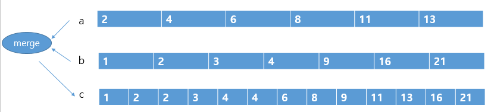
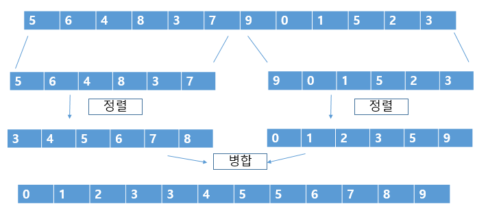

#### 병합(merge) 정렬

병합 정렬은 배열을 앞부분과 뒷부분으로 나누어 각각 정렬한 다음 병합하는 작업을 반복하여 정렬을 수행하는 알고리즘이다.


##### 정렬을 마친 배열의 병합 - MergeArray.java

정렬을 마친 두 배열의 **병합(merge)**을 살펴보자.

각 배열에서 선택한 요소의 값을 비교하여 작은 값의 요소를 꺼내 새로운 배열에 넣는 작업을 반복하여 정렬을 마치는 배열을 만든다.


아래의 그림은 이 과정을 수행하는 프로그램이다.

merge 메소드는 그림과 같이 요소의 개수가 na개인 **배열 a**와 요소의 개수가 nb개인 **배열 b**를 병합하여 **배열 c**에 저장한다.




* 배열 a,b,c를 스캔할 때 선택한 요소의 인덱스는 pa,pb,pc이다.
* 이 인덱스를 저장한 변수를 커서라 부른다.
* 처음에는 첫 요소를 선택하므로 커서를 모두 0으로 초기화한다.


1. 배열 a에서 선택한 요소 (a[pa])와 배열 b에서 선택한 요소 (b[pb])를 비교하여 작은 값을 c[pc]에 저장한다.


1. 그런 다음 pb, pc를 한칸 옮기고 커서 pa는 그대로 둔다.

   1. 위 그림에서는 pb[0] = 1 인데 pa[0]은 =2라서 pb를 pc에 넣고 인덱스를 올리는것이다.

   

2. 커서 pa, pb가 가리키는 값을 비교하여 작은 값을 c[pc]에 대입하고 커서 pa, pb, pc를 진행하는 작업을 반복한다.  커서 pa가 배열 a의 끝에 다다르거나 커서 pb가 배열 b의 끝에 다다르면 이작업을 종료한다.


=============================================================================

병합(merge) 정렬

정렬을 마친 배열의 병합을 응용하여 **분할 정복법에 따라 정렬하는 알고리즘을 병합 정렬**이라고 한다.

아래 그림은 병합 정렬 과정을 간단히 나타낸 것으로, 먼저 배열을 앞부분과 뒷부분으로 나눈다.

아래 그림은 배열의 요소가 12개이므로 6개의 배열로 각각 나눈다.

나눈 두 배열을 각각 정렬하고 병합하면 배열 모두를 정렬 할 수 있다.





이 때 앞 뒤에 놓인 6개의 요소를 정렬할 때는 그냥 정렬하는 것이 아니라 다시 병합 정렬을 적용한다.

ex) 뒷부분은 다음 그림 처럼 정렬한다. 이 과정에서 만들어지는 앞부분({9, 0, 1})과 뒷부분({5, 2, 3})도 같은 순서에 따라 정렬한다.


병합 정렬 알고리즘 - **MergeSort.java**

병합 정렬 알고리즘의 순서를 정리하면 다음과 같다.

```
배열의 요소 개수가 2개 이상인 경우
1. 배열의 앞부분을 병합 정렬로 정렬한다.
2. 배열의 뒷부분을 병합 정렬로 정렬한다.
3. 배열의 앞부분과 뒷부분을 병합한다.
```


* mergeSort 메서드는 병합한 결과를 일시적으로 저장할 작업용 배열인 buff를 생성한다.
* 실제로 정렬 작업을 수행할 __mergeSort 메서드를 호출한다.


__mergeSort 메서드는 a(정렬할 배열), left, right(첫 번째, 마지막 요소의 인덱스)를 인자로 전달 받으며

left가 right보다 작을 때 동작한다.

**가장 먼저 앞부분 (a[left] ~ a[center])과 뒷부분 (a[center+1] ~ a[right])에 대해서 __mergeSort 메서드를 재귀 호출한다**.


병합 순서는 다음과 같다.

1. 배열의 앞부분(a[left] ~ a[center])을 buff[0] ~ buff[center - left]에 복사한다. for문이 끝날 때 p의 값은 복사한 요소의 개수 center - left + 1이 된다.


2. 배열의 뒷부분(a[center + 1] ~ a[right])과 buff로 복사한 배열의 앞부분 p개를 병합한 결과를 배열 a에 저장한다. 


3. 배열 buff에 남아 있는 요소를 배열 a에 복사한다.


**배열 병합의 시간 복잡도는 O(n)**이고 데이터의 요소 개수가 n개 일 때, 병합 정렬의 단계는 log n 만큼 필요하므로 **전체 시간복잡도는 O(n log n)**이다.

병합 정렬은 서로 떨어져 있는 요소는 교환하는 것이 아니므로 안정적인 정렬 방법이라고 할 수 있다.


==============================================================================


솔직히 재귀는 개어려운데.. 

Arrays.sort로 정렬하자 퀵정렬 하자..

빠르게 코드 눈 들이고


과제는..  실행 결과에서 분할 정렬 과정 출력 및 상세한 설명 쓸 것

